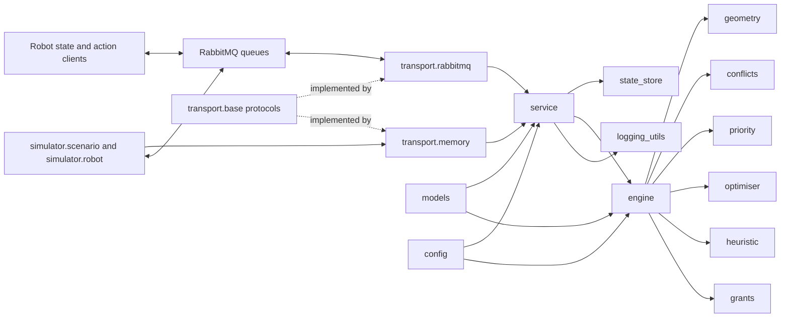
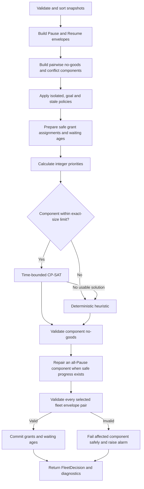

# Implemented architecture

The Collision Monitor is an asynchronous application around a synchronous,
transport-independent decision engine. Robot states are retained as the latest
validated value per device. Each tick converts that immutable fleet snapshot
into exactly one Pause or Resume decision per known robot, validates the
selected envelopes, records a structured trace and then publishes the actions.

## Components

`service` depends only on the `StateConsumer` and `ActionPublisher` protocols
from `transport.base`. Consequently, `transport.rabbitmq` and
`transport.memory` can be exchanged without changing the decision pipeline.
The `engine` imports neither transport adapter: its caller supplies snapshots,
`now_ms` and `tick_id`, and it returns a `FleetDecision` without performing
I/O, sleeping, logging or reading a clock.

## Decision flow

Safety checks are deliberately repeated. `optimiser` and `heuristic`
independently validate their completed assignments against the component
no-goods. `grants` accepts or retains a grant only when its forced Resume can
participate in a safe complete assignment. Finally,
`engine.validate_global_safety` checks every pair of selected action envelopes,
including robots assigned to different graph components, before state is
committed or the service publishes an action. A failure produces conservative
component decisions and explicit diagnostics.

Determinism is enforced by sorted robot identifiers in `engine`, `conflicts`,
`priority`, `optimiser`, `heuristic` and `grants`; deterministic connected
components; one CP-SAT worker with a fixed seed; stable utility tie-breaking;
and explicit caller-provided time values. Stateful grant and waiting-age
updates occur only after a validated tick.

Observability is implemented in `engine` and `service`. The engine returns
constraint, component, priority, solver, grant, action and safety metadata.
The service adds state ages, timestamps, `run_id`, publication outcomes and
alarms, then `logging_utils` emits one redacted JSON object per log line.

## Python modules

| Module | Responsibility | Module | Responsibility |
|---|---|---|---|
| `collision_monitor.__init__` | Exposes principal public types. | `collision_monitor.__main__` | Implements CLI commands and signal handling. |
| `collision_monitor.config` | Validates environment settings. | `collision_monitor.models` | Defines boundary and immutable domain types. |
| `collision_monitor.geometry` | Builds conservative envelopes and tests intersection. | `collision_monitor.conflicts` | Creates pairwise no-goods and graph components. |
| `collision_monitor.priority` | Calculates bounded integer utilities. | `collision_monitor.optimiser` | Runs bounded CP-SAT and validates assignments. |
| `collision_monitor.heuristic` | Provides deterministic propagation and repair. | `collision_monitor.grants` | Maintains grants, waiting ages and progress safeguards. |
| `collision_monitor.engine` | Orchestrates decisions and global validation. | `collision_monitor.state_store` | Retains latest states and marks stale snapshots. |
| `collision_monitor.service` | Runs ingestion, ticks, traces and publication retries. | `collision_monitor.logging_utils` | Formats redacted JSON or console logs. |
| `collision_monitor.transport.__init__` | Exposes transport contracts and adapters. | `collision_monitor.transport.base` | Defines transport protocols and the action schema. |
| `collision_monitor.transport.memory` | Implements deterministic in-memory adapters. | `collision_monitor.transport.rabbitmq` | Implements aio-pika acknowledgement and confirmed publication. |
| `collision_monitor.simulator.__init__` | Exposes the simulator API. | `collision_monitor.simulator.robot` | Models one-node-per-tick movement and counters. |
| `collision_monitor.simulator.scenario` | Loads and coordinates scenario ticks. | `collision_monitor.simulator.cli` | Runs a scenario and prints its JSON summary. |
